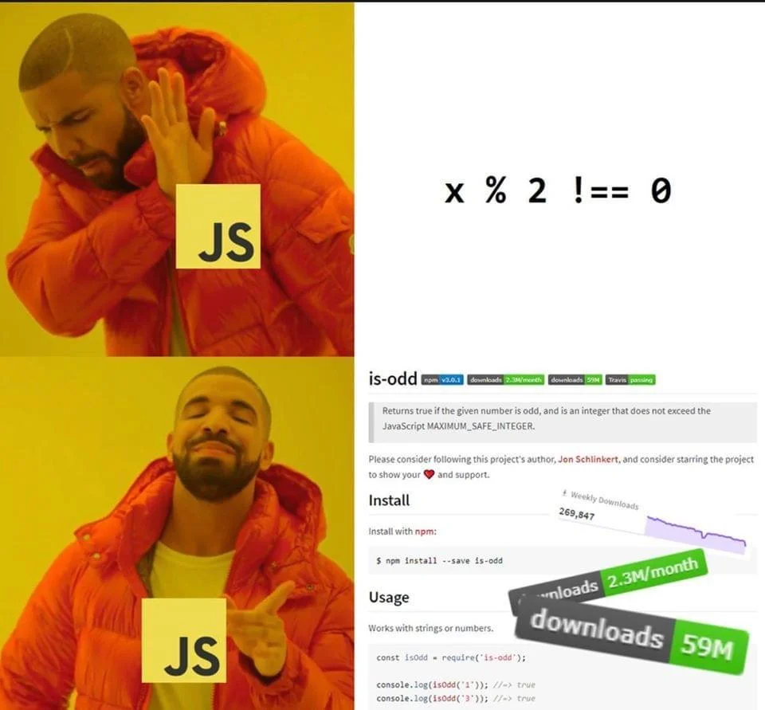

<h1 align="center">
<strong>AUT_AP_2024_Spring Bonus Homework</strong>
</h1>

<p align="center">
<strong> Deadline: 11th of Ordibehesht - 23:59 o'clock</strong>
</p>

<h1 align="Center">Pig Game Implementation Using JavaScript</h1>

<p align="center">
  
</p>

# Pig Game Project Introduction

Welcome to your **BONUS** project on implementing the Pig Game! This document outlines the core objectives of the project, providing you with essential information and guidelines to help you successfully complete the game's functionality using JavaScript. Before diving into the development aspects, let's understand the game itself.

## Understanding the Pig Game

**Pig Game** is a popular dice game involving rounds of rolling dice to accumulate points, with the risk of losing all points in a round if a player rolls a 1. Here’s a brief overview:

- **Gameplay**: Players take turns to roll a single dice as many times as they wish, accumulating points. However, if a player rolls a 1, their turn ends, and they lose all points accumulated in that turn.
- **Winning**: The first player to reach 100 points or more across all turns wins the game.

# Pig Game JavaScript Implementation Guide

Welcome to the JavaScript implementation phase of the Pig Game! This section outlines the specific tasks and objectives you must achieve to make the provided HTML and CSS functional. Follow these steps carefully to ensure your game behaves as expected.

## Objective Overview

Your main goal is to develop the JavaScript functionality that allows two players to play the Pig game. This includes handling dice rolls, updating scores, managing game state changes, and initializing the game correctly.

## Detailed Implementation Steps

### Step 1: Initialize the Game

- **Objective**: Set up the initial game state when the page loads or when the "New Game" button is pressed.
- **Tasks**:
  - Reset all scores to 0 and set the initial player (First Player) as active.
  - Ensure the dice image is hidden, at the beginning of the game. (You can add a "**hidden**" class to its classList)
  - Update the UI to reflect these initial states using DOM manipulation.

### Step 2: Making the Dice Roll Functional

- **Objective**: Implement the dice roll functionality when the "Roll Dice" button is clicked.
- **Tasks**:
  - Generate a random number between 1 and 6 to simulate a dice roll.
  - Update the dice image to match the roll result.
  - If the dice roll is 1:
    - Reset the current score of the active player to 0.
    - Switch to the other player.
  - If the dice roll is anything other than 1:
    - Add the roll value to the active player's current score.
    - Update the current score display in the UI.

### Step 3: Implementing the Hold Functionality

- **Objective**: Allow players to "hold" their current score, which adds it to their total and switches the turn.
- **Tasks**:
  - Add the current score to the active player's total score.
  - Update the total score display on the UI.
  - Reset the current score of the active player to 0.
  - Switch the active player and update the UI to reflect this change.

### Step 4: Handling the Game Ending

- **Objective**: Define what happens when a player reaches the winning score (typically 100 points).
- **Tasks**:
  - Check the player's total score after the "hold" action to see if it reaches or exceeds 100.
  - If a player wins:
    - Display a celebration icon (🎉) in place of their current score.
    - Change the background color of the page to **#E64980**.
    - Disable the "Roll Dice" and "Hold" buttons to prevent further play.
    - Allow only the "New Game" button to function to restart the game.

### Step 5: Resetting the Game

- **Objective**: Ensure the "New Game" button resets the game entirely.
- **Tasks**:
  - Call the initial game setup function to reset all scores, player states, and UI elements like the dice image and background color.

### Step 6: Testing and Debugging

- **Objective**: Verify that all functionalities work seamlessly and handle all edge cases.
- **Tasks**:
  - Test each functionality individually and in sequence.
  - Check responsiveness of the UI to game state changes.
  - Use console logs to debug and ensure that score calculations and player switches are handled correctly.

## Additional Tips

- **Code Modularity**: Keep your functions small and focused. Each function should perform one task.
- **Use Comments**: Comment your code to explain why you are doing something, not what you are doing.
- **Consistent Naming Convention**: Use clear and descriptive names for variables and functions to make your code readable and maintainable.

# JavaScript Essentials For This Project

## Section 1: Basics and Syntax

In this section, we explore the foundational elements of JavaScript crucial for building interactive games and applications like the Pig game. Understanding these basics will enable you to write more effective and error-free code.

### 1.1 Strict Mode

**What is Strict Mode?**

Strict Mode is a feature in JavaScript that makes your code more robust by enabling a stricter set of rules. Activating Strict Mode helps in catching common coding bloopers, preventing potentially problematic actions, and alerting developers by throwing errors.

**Why Use Strict Mode?**

- **Catches Common Errors**: Helps in identifying typos in variable names, unsafe actions, etc.
- **Prevents Bad Syntax**: Stops you from using parts of JavaScript that are not advisable or that are obsolete.
- **Secures JavaScript**: It provides a layer of security by correcting mistakes that make it difficult for JavaScript engines to perform optimizations.

**How to Enable Strict Mode?**

To enable Strict Mode, add the string `'use strict';` at the beginning of your JavaScript files or functions. This tells the JavaScript engine to evaluate the code more rigorously.

### 1.2 Variables: `let` and `const`

**Understanding Variables**

Variables are fundamental in any programming language. They are used to store data values. In JavaScript, variables can be declared using `let`, `const`, or `var` (though `var` is mostly historical and its use is generally discouraged in modern JavaScript practices).

**`let` vs. `const`**

- **`let`**: Allows you to declare variables that can be changed later. Use `let` when you expect the variable to be reassigned later in your program.
- **`const`**: Allows you to declare variables with a constant value, meaning the value assigned to `const` cannot be changed (though objects and arrays defined with `const` can still be mutated).

**Examples**

```javascript
let playerName = "John";
const maxScore = 100;

playerName = "Doe"; // This is allowed
maxScore = 200; // This will throw an error because const values cannot be reassigned
```

**Best Practices**

- Prefer `const` by default; only use `let` if you know the variable's value will change.
- **Avoid** `var` to reduce scope-related issues.

## Section 2: Functions in JavaScript

In this section, we explore functions in JavaScript, which are essential for structuring and organizing code, especially when building interactive applications like the Pig game. Understanding functions allows you to create reusable code and implement game logic effectively.

### 2.1 Understanding Functions

**What is a Function?**

A function in JavaScript is a reusable block of code designed to perform a particular task. Functions are executed when they are called or invoked. This is useful in games for tasks that need to be repeated with slight variations.

**Why Use Functions?**

- **Code Reusability**: Write code once, use it multiple times.
- **Modularity**: Break down complex problems into smaller, manageable tasks.
- **Maintainability**: Easier to debug and update individual sections of the code.

### 2.2 Declaring Functions

**Function Declaration**

A function declaration defines a function without running it. It's one of the ways to create a function. Here's the basic syntax:

```javascript
function myFunction() {
  // Code to execute
}
```

**Function Expression**

Alternatively, you can define a function using a function expression, which allows you to create anonymous functions (functions without a name).

```javascript
const myFunction = function () {
  // Code to execute
};
```

### 2.3 Parameters and Arguments

**Parameters vs. Arguments**

- **Parameters**: Variables listed as part of the function's definition.
- **Arguments**: Values passed to the function when it is invoked.

**Example**

```javascript
function addNumbers(a, b) {
  return a + b;
}

const sum = addNumbers(5, 3); // 5 and 3 are arguments
```

**Default Parameters**

You can also set default values for parameters that are used if no argument is passed during the function call.

```javascript
function greet(name = "Guest") {
  return `Hello, ${name}!`;
}

console.log(greet("Alice")); // Output: Hello, Alice!
console.log(greet()); // Output: Hello, Guest!
```

### 2.4 Return Statements

**What is a Return Statement?**

The return statement ends function execution and specifies a value to be returned to the function caller.

**Why Use Return Statements?**

- To output a result from a function.
- To stop the execution of a function at a specific point and send the control back to the place it was called.

**Example**

```javascript
function multiply(x, y) {
  return x * y; // Returns the product of x and y
}

const result = multiply(4, 3); // result is 12
```

**No Return Statement**

If no return statement is used, the function returns `undefined` by default.

### 2.5 Best Practices

- **Naming**: Use clear, descriptive names for functions.
- **Single Responsibility**: Each function should perform one task or function.
- **Commenting**: Use comments to describe what the function does, especially if the logic is complex.

## Section 3: Control Structures in JavaScript

Control structures are fundamental in programming, allowing you to dictate the flow of control through your code. In this section, we'll explore how to use conditional statements and logical operators in JavaScript to implement game logic effectively.

### 3.1 Conditional Statements

**What are Conditional Statements?**

Conditional statements execute different parts of code based on whether a specified condition is true or false. They are crucial for decision-making in programming.

**Types of Conditional Statements**

- **`if` Statement**: Executes a block of code if a specified condition is true.
- **`else` Statement**: Executes a block of code if the associated `if` condition is false.
- **`else if` Statement**: Specifies a new condition to test if the first condition is false.

**Syntax and Example**

```javascript
if (condition1) {
  // Code to execute if condition1 is true
} else if (condition2) {
  // Code to execute if condition1 is false and condition2 is true
} else {
  // Code to execute if both condition1 and condition2 are false
}
```

**Practical Use Case**

Imagine checking if a player has enough points to win a game:

```javascript
let score = 95;

if (score >= 100) {
  console.log("You won!");
} else {
  console.log("Keep trying, you need more points to win!");
}
```

### 3.2 Logical Operators

**What are Logical Operators?**

Logical operators are used to combine multiple conditions. They are essential for creating complex logical expressions.

**Common Logical Operators**

- **AND (`&&`)**: Returns true if both operands are true.
- **OR (`||`)**: Returns true if at least one operand is true.
- **NOT (`!`)**: Returns true if the operand is false (and vice versa).

**Example**

```javascript
let score = 120;
let timeLeft = 5;

if (score >= 100 && timeLeft > 0) {
  console.log("You won!");
} else {
  console.log("Game over!");
}
```

In this example, the player wins only if they have scored 100 points or more **and** there is still time left.

### 3.3 The Switch Statement

**Alternative to Multiple `if` Statements**

The `switch` statement is used for performing different actions based on different conditions. It's particularly useful when comparing the same variable to different values.

**Syntax and Example**

```javascript
let fruit = "apple";

switch (fruit) {
  case "apple":
    console.log("Apples are $0.65 per pound.");
    break;
  case "banana":
    console.log("Bananas are $0.35 per pound.");
    break;
  default:
    console.log("Sorry, we are out of " + fruit + ".");
}
```

### 3.4 Best Practices

- **Clear Conditions**: Write conditions that are simple and clear to understand.
- **Limit Logical Complexity**: Avoid overly complex expressions in if conditions.
- **Use `switch` Sparingly**: While `switch` is useful, it can lead to harder-to-maintain code if overused, especially with large sets of conditions.

## Section 4: DOM Manipulation in JavaScript

DOM manipulation is a critical skill for any web developer. It allows you to interact with and change the content and structure of a webpage dynamically. In this section, we will cover how to select elements, manipulate classes, and change attributes and text content in the context of building interactive web applications like the Pig game.

### 4.1 Selecting Elements

**What is DOM Selection?**

DOM selection is the process of selecting elements from the HTML document using JavaScript, which then allows you to manipulate those elements.

**Methods of Selection**

1. **By ID**:

   - `getElementById()`: Selects an element by its ID. It's a fast and efficient way to access elements if you know their ID.
   - **Example**: `let playerScore = document.getElementById('score--1');`

2. **By Class Name**:

   - `getElementsByClassName()`: Selects all elements that have a specified class name. This method returns a live HTMLCollection.
   - **Example**: `let buttons = document.getElementsByClassName('btn');`

3. **Query Selector**:
   - `querySelector()`: Uses CSS selectors to select the first matching element. It's very versatile.
   - `querySelectorAll()`: Selects all elements that match the CSS selector. It returns a static NodeList.
   - **Examples**:
     - `let diceImage = document.querySelector('.dice');`
     - `let allPlayers = document.querySelectorAll('.player');`

### 4.2 Manipulating Classes

**Using `classList`**

The `classList` property provides methods to add, remove, and toggle CSS classes on an element.

- **`add()`**: Adds a specified class to an element.
- **`remove()`**: Removes a specified class from an element.
- **`toggle()`**: Toggles a class on an element (adds it if it doesn't exist, removes it if it does).

**Examples**

```javascript
let player = document.querySelector(".player--active");

// Adding an active class
player.classList.add("active");

// Removing an active class
player.classList.remove("active");

// Toggling a class
player.classList.toggle("active");
```

### 4.3 Setting Text and Attributes

**Changing Text Content**

- **`textContent`**: Sets or returns the text content of the specified node and all its descendants.
- **Example**: `document.getElementById('score--0').textContent = '50';`

**Manipulating Attributes**

- **`setAttribute()`**: Adds a new attribute or changes the value of an existing attribute on the specified element.
- **`getAttribute()`**: Returns the current value of an attribute on the element.
- **`src` Attribute**: Commonly used to set the source of an image element.

**Examples**

```javascript
// Setting the source of an image
let dice = document.querySelector(".dice");
dice.src = "dice-3.png";

// Changing attributes
dice.setAttribute("alt", "Dice three");
```

### 4.4 Best Practices

- **Minimize DOM Manipulations**: Each manipulation can affect performance, so minimize direct DOM manipulation where possible.
- **Use IDs for Single Elements**: When you need to select a single element, use an ID if possible for faster selection.
- **Cache DOM References**: Store DOM references in variables if you need to access the same element multiple times.

## Section 5: Event Handling in JavaScript

Event handling is a cornerstone of interactive web development, allowing your applications to respond to user actions such as clicks, keyboard input, and more. This section explains how to implement event handling in JavaScript, which is crucial for creating dynamic behaviors in games like the Pig game.

### 5.1 Understanding Events

**What is an Event?**

An event in JavaScript is any interaction that a user can have with a webpage. Common events include clicks, hovering over elements, pressing keys, and loading pages.

**Why Handle Events?**

Handling events allows your web applications to be interactive and responsive to user actions, making them more engaging and functional.

### 5.2 Adding Event Listeners

**What is an Event Listener?**

An event listener is a function in JavaScript that will be called whenever the specified event fires on the target element.

**Syntax of `addEventListener()`**

```javascript
element.addEventListener(event, function, useCapture);
```

- **element**: The DOM element to listen on.
- **event**: The name of the event to listen for.
- **function**: The handler function to run when the event occurs.
- **useCapture**: Optional boolean value that specifies whether to handle the event in the capturing or in the bubbling phase.

**Example**

```javascript
const button = document.querySelector(".btn--roll");
button.addEventListener("click", function () {
  console.log("Button was clicked!");
});
```

### 5.3 Writing Event Handlers

**What is an Event Handler?**

An event handler is a function that is triggered when the event it listens to occurs. This function can perform any number of actions, from updating HTML content to modifying CSS styles or triggering other events.

**Example of an Event Handler**

```javascript
function rollDice() {
  // Simulate rolling a dice
  const diceValue = Math.floor(Math.random() * 6) + 1;
  console.log(`You rolled a ${diceValue}!`);
}
```

**Using the Event Handler**

```javascript
button.addEventListener("click", rollDice);
```

### 5.4 Event Object

**What is the Event Object?**

The event object is a parameter that is automatically passed to event handlers by the browser. It contains properties and methods related to the event, such as the type of event, the target element, and more.

**Using the Event Object**

```javascript
button.addEventListener("click", function (event) {
  console.log(event.type); // Logs 'click'
});
```

### 5.5 Removing Event Listeners

Although not as commonly required in simple games, knowing how to remove event listeners is important for avoiding memory leaks in larger applications.

**Syntax**

```javascript
element.removeEventListener(event, handler);
```

**Example**

```javascript
button.removeEventListener("click", rollDice);
```

### 5.6 Best Practices

- **Don’t Overuse Inline Event Handlers**: Inline event handlers (e.g., `<button onclick="alert('Clicked!')">Click me!</button>`) are harder to maintain and debug compared to `addEventListener`.
- **Use Named Functions for Clarity**: Named functions make your code more readable and easier to debug than anonymous functions in your event listeners.
- **Debounce and Throttle**: Use debouncing and throttling techniques to limit the rate at which a function is executed, particularly useful in handling events like resizing or scrolling.

## Section 6: Debugging JavaScript Techniques

In the final section of our JavaScript fundamentals course for the Pig game, we delve into some debugging techniques that enhance debugging, dynamic styling, and efficient gameplay logic. These skills are essential for creating robust, maintainable, and dynamic web applications.

### 6.1 Error Handling and Logging

**What is Console Logging?**

Logging is a debugging method that outputs messages or variables to the console, providing insight into the code's behavior at runtime.

**Using `console.log()`**

- **Purpose**: Primarily used for general debugging and information logging.
- **Example**:
  ```javascript
  console.log("This is a log message.");
  ```

**Using `console.error()`**

- **Purpose**: Specifically used for logging error messages, making them easily distinguishable in the console.
- **Example**:
  ```javascript
  console.error("This is an error message.");
  ```

### 6.2 CSS Manipulation via JavaScript

**Dynamic Styling**

Changing styles through JavaScript allows for interactive and responsive design changes based on user interactions or other conditions.

**Modifying Styles**

- **Syntax**: `element.style.property = 'value';`
- **Example**:
  ```javascript
  document.body.style.backgroundColor = "#ff0000"; // Changes background color to red
  ```

**Adding and Removing Background Images**

- **Setting a Background Image**:
  ```javascript
  document.body.style.backgroundImage = 'url("background.jpg")';
  ```
- **Removing a Background Image**:
  ```javascript
  document.body.style.backgroundImage = "none";
  ```

### 6.3 Toggle Using Modulo Operator

**Using the Modulo Operator for Toggling**

The modulo operator (`%`) is useful for toggling between values within a range, particularly common in games for switching turns.

- **Example**:
  ```javascript
  let currentPlayer = 1;
  currentPlayer = (currentPlayer + 1) % 2; // Toggles between 0 and 1
  ```

This method is efficient for cycling through a series of values without needing conditional statements.

### 6.4 Global Variables

**Scope and Usage of Global Variables**

Global variables are accessible from anywhere in your JavaScript code. While they can be very useful, especially in shared game states, they should be used sparingly due to potential conflicts and debugging complexity.

**Defining Global Variables**

- Declare outside any function to make them accessible universally.
- **Example**:
  ```javascript
  let gameActive = true;
  ```

**Best Practices for Global Variables**

- **Minimize Use**: Try to keep global variables to a minimum. Use local variables or function parameters where possible.
- **Naming Convention**: Use clear, descriptive names to avoid conflicts and enhance readability.

# Last Word

For your assignment, **please replace only the JavaScript** code with your own implementation based on the guidelines provided. Once you have completed your version, submit your results on your course page for evaluation. Make sure your implementation adheres to the project requirements and functions as expected. Good luck!

<p align="center">
  
</p>

**Best Regards, Hamidi**
